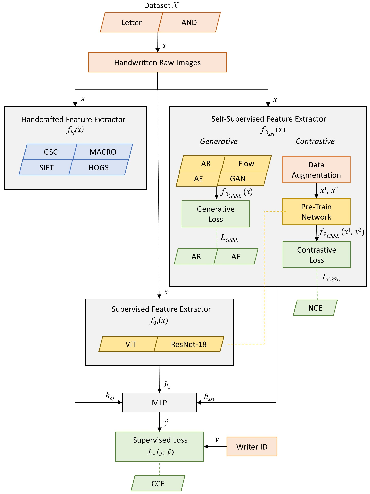

# SSL-HV: Self Supervised Learning based Handwriting Verification
This repository provides a PyTorch Lightning implementation and Pretrained models for SSL-HV, as described in the paper SSL-HV: Self Supervised Learning based Handwriting Verification <br>
_Mihir Chauhan, Mohammad Abuzar Shaikh, Bina Ramamurthy, Mingchen Gao, Siwei Lyu and Sargur Srihari_ <br>
_The State Unviersity of New York at Buffalo, USA_ <br>

## SSL-HV Approach


## CEDAR Handwriting Dataset
| Dataset | Link to Drive |
|:-----------|:------------:|
| CEDAR Letter Images | [Link](https://drive.google.com/drive/folders/1fwRlwtfzV_5Pnyxm9ahQLi2eum2rDshk?usp=sharing)  |
| CEDAR AND Images| [Link](https://drive.google.com/drive/folders/1uj6eeaKBmabivxvRqrGokrcCb3B9yAHu?usp=sharing)  |
| CEDAR AND GSC Features | [Link](https://drive.google.com/drive/folders/1sqKDswK-w2elL8uuJD0HdqlBZNd1hvFG?usp=sharing) |

## SL-HV: Supervised Handwriting Verification (Baseline)
| Model                                 | Accuracy  | Precision | Recall    | F1-Score |  Pre-Trained Model |Paper Cite | Code Cite
|:------------|:----------:|:----------:|:----------:|:----------:|:----------:|:----------:|:----------:|
| GSC             | 0.71 / 0.78 | 0.69 / 0.81 | 0.72 / 0.77 | 0.69 / 0.79 | [Link](https://drive.google.com/drive/folders/1N59FYEdCqo7-ogTeT75TOFgR47SJXDc6?usp=drive_link) |[Link](https://onlinelibrary.wiley.com/doi/abs/10.1002/%28SICI%291098-1098%28199624%297%3A4%3C304%3A%3AAID-IMA5%3E3.0.CO%3B2-C) |- |
| ResNet-18 | 0.72 / 0.84 | 0.70 / 0.86 | 0.73 / 0.82 | 0.72 / 0.84 | [Link](https://drive.google.com/drive/folders/1aqpVWjpv9AGkHC8dgmh0WOBxPY_qrrXu?usp=drive_link) |[Link](https://arxiv.org/abs/1512.03385) |[Link](https://pytorch.org/vision/main/models/generated/torchvision.models.resnet18.html) |
| ViT | 0.65 / 0.79 | 0.68 / 0.80 | 0.64 / 0.78 | 0.66 / 0.79 | [Link](https://drive.google.com/drive/folders/1qaU5THJDpUN2vTNskvJGEciZk_A-H1tN?usp=drive_link) |[Link](https://arxiv.org/abs/2010.11929) |[Link](https://github.com/lightly-ai/lightly/blob/master/lightly/models/modules/masked_causal_vision_transformer.py) |

## CSSL-HV: Contrastive Self-Supervised Handwriting Verification
| Model  | Intra-Nd | Inter-Nd | Intra-2d | Inter-2d | Accuracy |  Pre-Trained Model |Paper Cite | Code Cite
|:-------------|:----------:|:----------:|:----------:|:----------:|:----------:| :----------:|:----------:|:----------:|
| Raw Pixels | 0.96     | 0.95     | 0.07     | -0.02    | 0.63     |- | - | - |
| HOGS  | 0.57     | 0.02     | 0.63     | 0.11     | 0.72     |[Link](https://drive.google.com/drive/folders/1vYEkDRKhh7OB5OZIj-fo9_iRRME2jzMz?usp=drive_link) |[Link](https://ieeexplore.ieee.org/document/1467360) |[Link](https://docs.opencv.org/4.x/d5/d33/structcv_1_1HOGDescriptor.html) |
| GSC   | 0.92     | 0.67     | 0.86     | 0.56     | 0.71     |[Link](https://drive.google.com/drive/folders/1N59FYEdCqo7-ogTeT75TOFgR47SJXDc6?usp=drive_link) |[Link](https://onlinelibrary.wiley.com/doi/abs/10.1002/%28SICI%291098-1098%28199624%297%3A4%3C304%3A%3AAID-IMA5%3E3.0.CO%3B2-C) |- |
| AIM  | 0.32     | -0.05    | 0.78     | 0.75     | 0.73     |[Link](https://drive.google.com/drive/folders/1hnaXEvKn1LQLcf3rIUPYGe77WJY1liDg?usp=drive_link) |[Link](https://arxiv.org/abs/2401.08541) |[Link](https://docs.lightly.ai/self-supervised-learning/examples/aim.html) |
| Flow | 0.12 | 0.08 | 0.12 | 0.01 | 0.66 |[Link](https://drive.google.com/drive/folders/1BhO2V6lieSklhQN7WJiH55XDudQKQet3?usp=drive_link) |[Link](https://arxiv.org/abs/1410.8516) |[Link](https://lightning.ai/docs/pytorch/stable/notebooks/course_UvA-DL/09-normalizing-flows.html) |
| MAE  | 0.18     | 0.02     | 0.82     | 0.77     | 0.71     |[Link](https://drive.google.com/drive/folders/1ZnMO7lLq58mDodApOu8f4UUxMMLzQTVK?usp=drive_link) |[Link](https://arxiv.org/abs/2111.06377) |[Link](https://docs.lightly.ai/self-supervised-learning/examples/mae.html) |
| **VAE**  | 0.24 | 0.06 | 0.38 | 0.30 | **0.75** |[Link](https://drive.google.com/drive/folders/1kyH13FuqF0E5dkajGx256dmRcYFFDTRG?usp=drive_link) |[Link](https://arxiv.org/abs/1312.6114) |[Link](https://github.com/williamFalcon/pytorch-lightning-vae) |
| BiGAN  | 0.35 | 0.30 | 0.27 | 0.25 | 0.68 |[Link](https://drive.google.com/drive/folders/1Fukto6bQocx5aPKUwK3h4karprRtKXM2?usp=drive_link) |[Link](https://arxiv.org/abs/1605.09782) |[Link](https://github.com/jaeho3690/BidirectionalGAN) |

## GSSL-HV: Contrastive Self-Supervised Handwriting Verification
| Model  | Intra-Nd | Inter-Nd | Intra-2d | Inter-2d | Accuracy |  Pre-Trained Model | Paper Cite | Code Cite
|:----------|:----------:|:----------:|:----------:|:----------:|:----------:| :----------:| :----------:|:----------:|
| MoCo  | 0.89 | 0.78 | 0.92 | 0.73 | 0.73 |[Link](https://drive.google.com/drive/folders/1XHxKRdmayZ2Wya8PF5NMS3elNj--N6gn?usp=drive_link) |[Link](https://arxiv.org/abs/1911.05722v3) |[Link](https://docs.lightly.ai/self-supervised-learning/examples/moco.html) |
| SimClr | 0.89 | 0.87 | 0.87 | 0.85 | 0.72 |[Link](https://drive.google.com/drive/folders/1YuR-5BKBy0JxaHIGMlbGpCdplCnezvgj?usp=drive_link) |[Link](https://arxiv.org/abs/2002.05709) |[Link](https://docs.lightly.ai/self-supervised-learning/examples/simclr.html) |
| BYOL  | 0.88 | 0.84 | 0.91 | 0.97 | 0.73 |[Link](https://drive.google.com/drive/folders/171WZmgxx-E9YuHjtEuF4eIhnCTeS1gIX?usp=drive_link) |[Link](https://arxiv.org/abs/2006.07733) |[Link](https://docs.lightly.ai/self-supervised-learning/examples/byol.html) |
| SimSiam  | 0.87 | 0.81 | 0.94 | 0.84 | 0.75 |[Link](https://drive.google.com/drive/folders/1UOBuRCvyGd862-L21oKqEles5JuDPLj8?usp=drive_link) |[Link](https://arxiv.org/abs/2011.10566) |[Link](https://docs.lightly.ai/self-supervised-learning/examples/simsiam.html) |
| FastSiam  | 0.83 | 0.75 | 0.83 | 0.75 | 0.71 |[Link](https://drive.google.com/drive/folders/1ETYYTT4WMfR15iAVJ8Qvgif8VjyOXLok?usp=drive_link) |[Link](https://link.springer.com/chapter/10.1007/978-3-031-16788-1_4) |[Link](https://docs.lightly.ai/self-supervised-learning/examples/fastsiam.html) |
| DINO | 0.88 | 0.85 | 0.78 | 0.74 | 0.68 |[Link](https://drive.google.com/drive/folders/1tknq874xc2BPCF__EEKa7dwhL8hlCrAG?usp=drive_link) |[Link](https://arxiv.org/abs/2104.14294) |[Link](https://docs.lightly.ai/self-supervised-learning/examples/dino.html) |
| BarlowTwins | 0.87 | 0.79 | 0.66 | 0.38 | 0.76 |[Link](https://drive.google.com/drive/folders/10ZJVaqjZvyurhVymBTsLwyAtUUCawcnm?usp=drive_link) |[Link](https://arxiv.org/abs/2103.03230) |[Link](https://docs.lightly.ai/self-supervised-learning/examples/barlowtwins.html) |
| **VicReg** | 0.69 | 0.48 | 0.65 | 0.60 | **0.78** |[Link](https://drive.google.com/drive/folders/14Xh2mOQiJZn8Xmuz49vfSuR1kIrA1Dv_?usp=drive_link) |[Link](https://arxiv.org/abs/2105.04906) |[Link](https://docs.lightly.ai/self-supervised-learning/examples/vicreg.html) |

## Cite
[SSL-HV paper](https://arxiv.org/): (Pending Arxiv Moderation Id: 5617299)
```
@article{5617299,
  title={Self-Supervised based Handwriting Verification},
  author={Mihir Chauhan, Mohammad Abuzar Shaikh, Bina Ramamurthy, Mingchen Gao, Siwei Lyu and Sargur Srihari},
  journal={arXiv preprint arXiv:},
  year={2024}
}
```
